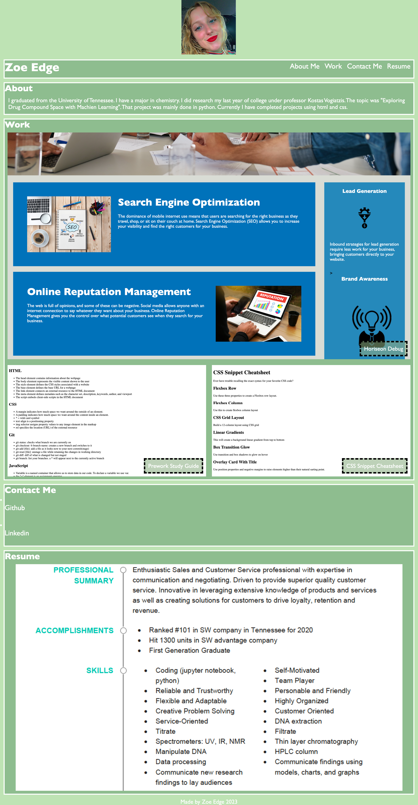

# Portfolio Project

This project uses HTML and CSS in order to create a personal portfolio. This portfolio will be used as a resume in order for potential employeers to view. 

## Acceptance Criteria 

It is done when I have a name, recent photo, and links to sections about myself, my work, and how to contact me. 
When I click on the links in the navigation, the page scrolls to the appropriate section.
When I click on the work section, the page scrolls to a section about my work with titled images of my applications.
When the first application is presented, it is a bigger image than the other applications. 
When I click on the images for my applications, then I am taken to the webpage. 
When I view the page in different formats, the layout responds appropriately.

## License
[MIT](https://choosealicense.com/licenses/mit/)

## Deployment

[Deployed](https://zoeedge16.github.io/personal-potfolio-html-css)

[Repository](https://github.com/zoeedge16)

## Screenshot 

